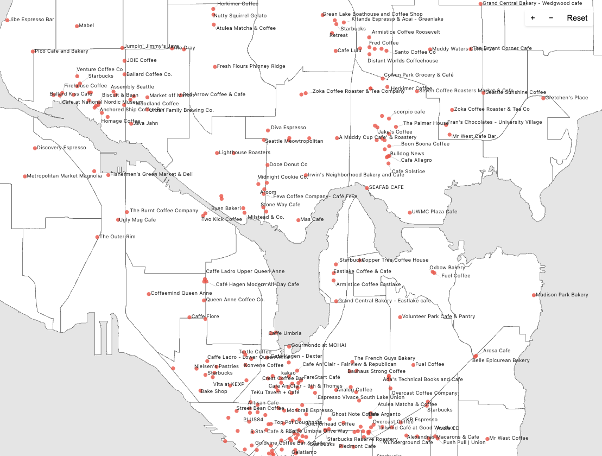

### Coffee Map

Exhaustive map of Seattle's coffee shops, uses Maps API.

<p align="center">
  
</p>

### Setup

```sh
echo "PLACES_API_KEY=[your_api_key_here]" > .env # add your API key from GCP
pip install -r requirements.txt
python coffee_shops.py # pull coffee shops to results.json
```

### Google Maps API Usage

Fortunately, GCP allows 10K free requests per month! Pulling seattle results usually takes ~45 requests.

- API Pricing: https://developers.google.com/maps/billing-and-pricing/pricing#places-pricing
- API Reference: https://developers.google.com/maps/documentation/places/web-service/reference/rest/v1/places/searchNearby
- API Docs: https://developers.google.com/maps/documentation/places/web-service/text-search